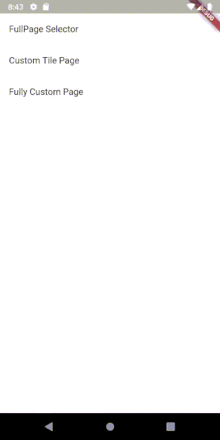

# ripple_color_selection

A simple color selection widget with a charming ripple effect



```dart
class FullPage extends StatelessWidget {
  @override
  Widget build(BuildContext context) {

    ColorSelectionController _controller = new ColorSelectionController();

    return Scaffold(
      body: Container(
        child: RippleColorSelection(
          controller: _controller,
        ),
      ),
    );
  }
}
```

You can also create your own custom tile:


```dart
import 'package:flutter/material.dart';
import 'package:ripple_color_selection/controller/color_selection_controller.dart';
import 'package:ripple_color_selection/holder_classes/color_selection_border_animation_holder.dart';
import 'color_selection_tile.dart';


class RectangleTile extends ColorSelectionTile {

  // the path will define the shape of the tile
  @override
  Path get path =>
      new Path()
        ..addRect(Rect.fromCenter(width: size.width,
            height: size.height,
            center: Offset(size.width / 2, size.height / 2)));

  @override
  CustomClipper get customClipper =>
      Clipper(
          path: path
      );

  // the padding between each tile
  @override
  double get padding => 5.0;

  // the passed parameter are required. You should include them in your own tile
  RectangleTile({
    @required Color color,
    @required Function onTap,
    @required ColorSelectionBorderAnimationHolder borderAnimation,
    @required ColorSelectionValue colorSelectionValue,
    @required GlobalKey key,
    bool hasShadow = true
  }) : super(
      color: color,
      onTap: onTap,
      key: key,
      borderAnimation: borderAnimation,
      colorSelectionValue: colorSelectionValue,
      hasShadow: hasShadow
  );

}
```

And here how you pass the new tile to the actual widget

```dart
class CustomTilePage extends StatelessWidget {

  ColorSelectionController _controller = new ColorSelectionController();

  @override
  Widget build(BuildContext context) {
    return Scaffold(
      body: Container(
        child: RippleColorSelection.customTile(
            rippleExpandDuration: const Duration(milliseconds: 1500),
            controller: _controller,
            // here in this tilebuilder you have to provide the custom tile
            tileBuilder: (key, color, holder, value, onTap){
              return RectangleTile(
                color: color,
                onTap: onTap,
                borderAnimation: holder,
                colorSelectionValue: value,
                key: key,
              );
            }
        ),
      ),
    );
  }
}
```

You're even able to go fully crazy and define a custom ripple :o


```dart
/// This page has a [CircleTile] as tapable widget
/// and a [RectangleTile] as the expanding widget, that
/// will grow underneath the clicked color
class FullyCustomPage extends StatelessWidget {

  ColorSelectionController _controller = new ColorSelectionController();

  @override
  Widget build(BuildContext context) {
    return Scaffold(
      body: Container(
        child: RippleColorSelection.custom(
            rippleExpandDuration: const Duration(seconds: 10),
            controller: _controller,
            tileBuilder: (key, color, holder, value, onTap){
              return RectangleTile(
                color: color,
                onTap: onTap,
                borderAnimation: holder,
                colorSelectionValue: value,
                key: key,
                hasShadow: false,
              );
            },
          rippleTileBuilder: (key, color, holder, value, onTap){
            return StarTile(
              color: color,
              onTap: onTap,
              borderAnimation: holder,
              colorSelectionValue: value,
              key: key,
            );
          },
        ),
      ),
    );
  }
}
```


# TODO

[] Make Widget working in Column without flexible
[] Make Widget not consume full height
[] Add some more tests
[] Make the Tilebuilder more simple
[] Make the Ripplebuilder more simple
[] Use a better method to draw border around tiles
[] Write some more examples

# License

```
MIT License

Copyright (c) 2019 Justin Vietz

Permission is hereby granted, free of charge, to any person obtaining a copy
of this software and associated documentation files (the "Software"), to deal
in the Software without restriction, including without limitation the rights
to use, copy, modify, merge, publish, distribute, sublicense, and/or sell
copies of the Software, and to permit persons to whom the Software is
furnished to do so, subject to the following conditions:

The above copyright notice and this permission notice shall be included in all
copies or substantial portions of the Software.

THE SOFTWARE IS PROVIDED "AS IS", WITHOUT WARRANTY OF ANY KIND, EXPRESS OR
IMPLIED, INCLUDING BUT NOT LIMITED TO THE WARRANTIES OF MERCHANTABILITY,
FITNESS FOR A PARTICULAR PURPOSE AND NONINFRINGEMENT. IN NO EVENT SHALL THE
AUTHORS OR COPYRIGHT HOLDERS BE LIABLE FOR ANY CLAIM, DAMAGES OR OTHER
LIABILITY, WHETHER IN AN ACTION OF CONTRACT, TORT OR OTHERWISE, ARISING FROM,
OUT OF OR IN CONNECTION WITH THE SOFTWARE OR THE USE OR OTHER DEALINGS IN THE
SOFTWARE.
```
