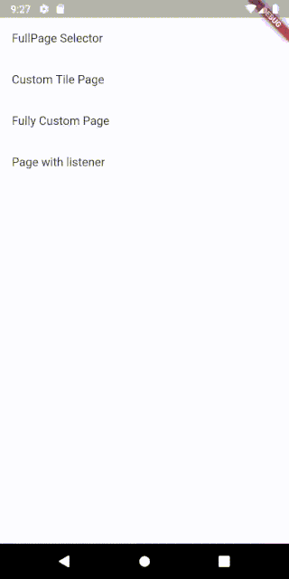

# Example

This is a simple example of the Usage of the ripple_color_selection Library.
You can find the full code of this package and it's examples on github.



```dart
class ColorSelectionPageWithListener extends StatefulWidget {
  @override
  _ColorSelectionPageWithListenerState createState() => _ColorSelectionPageWithListenerState();

  @override
  String toString({DiagnosticLevel minLevel = DiagnosticLevel.debug}) {
    return "Page with listener";
  }
}

class _ColorSelectionPageWithListenerState extends State<ColorSelectionPageWithListener> {

  ColorSelectionController _colorSelectionController;

  @override
  void initState() {
    _colorSelectionController = new ColorSelectionController();
    _colorSelectionController.addListener(() {
      setState(() {

      });
    });
    super.initState();
  }

  @override
  Widget build(BuildContext context) {
    return Scaffold(
      appBar: AppBar(
        title: Text("Sampletext"),
      ),
      body: Container(
        child: Column(
          children: <Widget>[
            Flexible(
              child: RippleColorSelection(
                controller: _colorSelectionController,
                colors: [
                  Colors.blue,
                  Colors.pink,
                  Colors.yellow,
                  Colors.green,
                  Colors.blue
                ],
              ),
            ),
            Text(_colorSelectionController.value.selectedColor.toString(), style: TextStyle(fontSize: 36.0, fontWeight: FontWeight.bold),),
          ],
        ),
      ),
    );
  }
}
```

